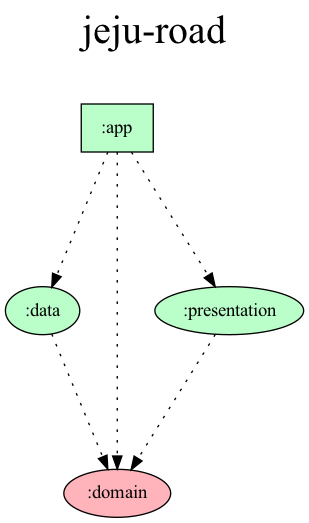

  <h1> jeju-road </h1>

Jeju Road Application is created for the convenience of travelers on Jeju Island.  
Implementation based on MVVM architecture and Clean architecture. Also, Fetch data from the network via repository pattern. 

 

## 📊 Android Project Dependency Graph

Creating an Android project dependency graph makes it easier to identify project dependencies.  
[It was written with reference to the JakeWharton project file.](https://github.com/JakeWharton/SdkSearch/blob/3351cad9bfacb0a364858e843774147143f58c7a/gradle/projectDependencyGraph.gradle)
  

  

 

## 📚 Stack & Libraries
- IDE : Android Studio
- Minimum SDK level 23
- Language : [Kotlin](https://kotlinlang.org/) based + Transfer build configuration from [Groovy](https://developer.android.com/studio/build/migrate-to-kts) to KTS + [Coroutines](https://github.com/Kotlin/kotlinx.coroutines) for asynchronous.
- Jetpack AAC
  - [LiveData](https://developer.android.com/topic/libraries/architecture/livedata) : Observable data holder class.
  - [LifeCycle](https://developer.android.com/topic/libraries/architecture/lifecycle) : Use lifecycle-aware components to perform actions in response to lifecycle events such as activities and fragments(viewmodel, livedata).
  - [ViewModel](https://developer.android.com/topic/libraries/architecture/viewmodel) : Manage data holder classes related to UI and performs asynchronous operations using coroutines for optimal processing.
- Test 
  - [JUnit](https://github.com/junit-team) : Simple framework to write repeatable tests. It is an instance of the xUnit architecture for unit testing frameworks.
  - [Espresso](https://developer.android.com/training/testing/espresso) : Use Espresso to write concise, beautiful, and reliable Android UI tests.
  - [Mockito](https://github.com/mockito/mockito) : Java mocking framework for unit testing.
  - [Roboletric](https://github.com/robolectric/robolectric) : Robolectric is a framework that brings fast and reliable unit tests to Android. Tests run inside the JVM on your workstation in seconds. 
- [Koin](https://github.com/InsertKoinIO/koin) : Dependency injection.
- [Retrofit2](https://github.com/square/retrofit) : REST APIs.
- [OkHttp3](https://github.com/square/okhttp) : Implementing interceptor, logging web server.
- [Glide](https://github.com/bumptech/glide) : Image loader.
- [Gson](https://github.com/google/gson) : Java library that can be used to convert Java Objects into their JSON representation.
- [SwipeRefreshLayout](https://developer.android.com/jetpack/androidx/releases/swiperefreshlayout) : Use to manually refresh the list of restaurants.
- [Shimmer](https://github.com/facebook/shimmer-android) : Use to implement skeleton loading screen

 

## 🔭 MAD SCORECARD

 

 

## 🛠 Architecture

Jeju Road is not using the local database yet.

 

## 📲 API

Refer to the [API document](http://183.107.10.236:8080/docs/index.html) provided by the backend team.

